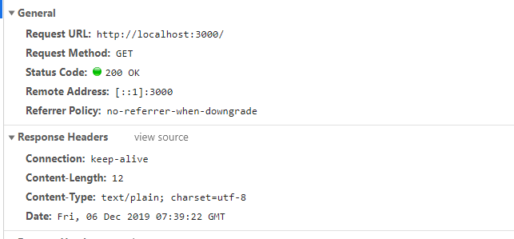
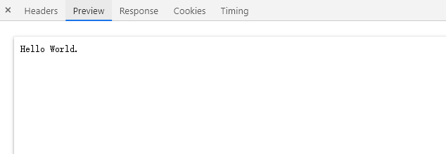
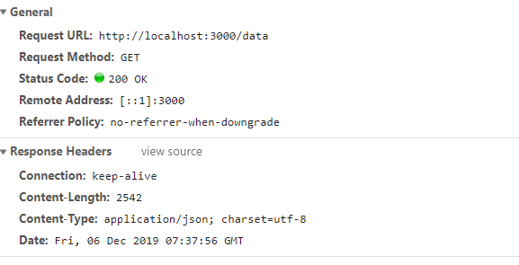
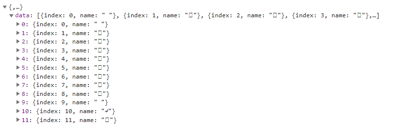
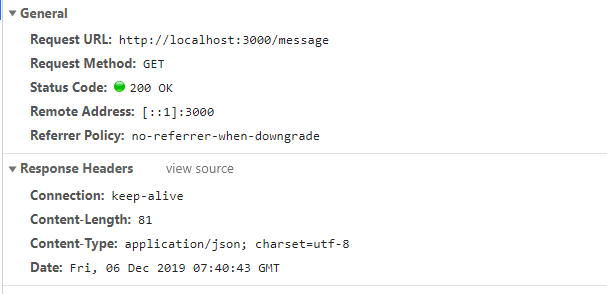
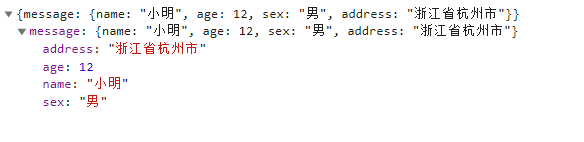

# koa-exp
一个基于koa的学习案例。

## 简介
koa 是由 Express 原班人马打造的，致力于成为一个更小、更富有表现力、更健壮的 Web 框架。使用 koa 编写 web 应用，通过组合不同的 generator，可以免除重复繁琐的回调函数嵌套，并极大地提升错误处理的效率。koa 不在内核方法中绑定任何中间件，它仅仅提供了一个轻量优雅的函数库，使得编写 Web 应用变得得心应手。

## 使用指南

### 1.生成koa实例
```
const Koa = require('koa');

const app = new Koa();
app.listen(3000); // 监听3000端口
```

### 2.koa-router使用
```
const Router = require('koa-router');

const router = new Router();
router.get('/', async (ctx) => {
  ctx.body = 'Hello World.'
})
```
koa实例使用router
```
const Koa = require('koa');
const router = require('./router/index')

const app = new Koa();
app.use(router.routes())
```

## 运行：
npm run server

## 接口
### 1.localhost:3000





### 2.localhost:3000/data





### 3.localhost:3000/message






